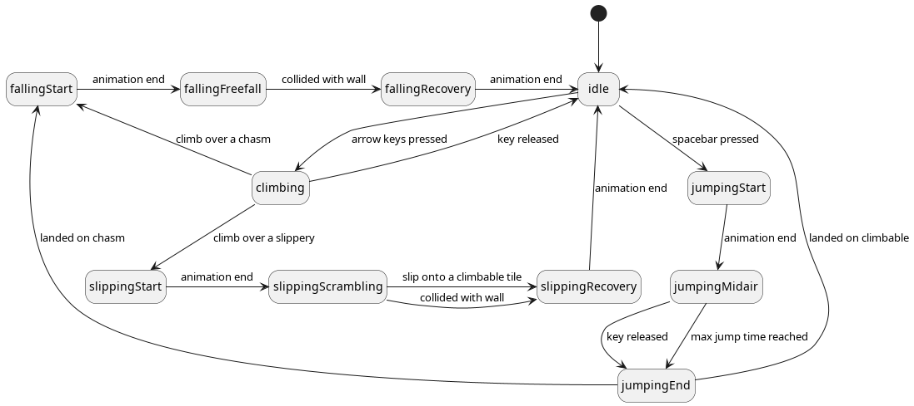

# project-scale

WIP: Entry for Github Game Off 2023

## For game testers

For alpha testing use [⬇️ this link](https://nightly.link/sinisterstuf/project-scale/workflows/build/main/project-scale-bundle.zip) to download the latest development build.

Game controls:
- F: toggle full-screen
- WASD, Arrows, Left Stick, D-Pad: climb
- Space, Button A: jump

If you find an issue with the game [please open a new ticket here](https://github.com/sinisterstuf/project-scale/issues).

## For programmers

Make sure you have [Go 1.19 or later](https://go.dev/) to contribute to the game

To build the game yourself, run: `go build .` it will produce a project-scale file and on Windows project-scale.exe.

To run the tests, run: `go test ./...` but there are no tests yet.

The project has a very simple, flat structure, the first place to start looking is the main.go file.

Here is a top-level state diagram using the animation states of the "Nanobot" player character:

